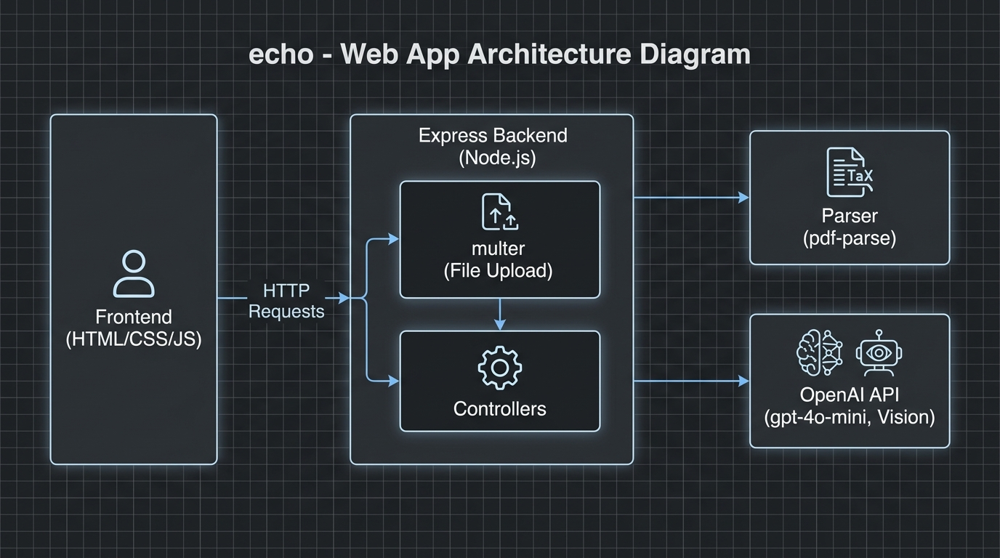

# echo - Social Content Analyzer

**echo** is an Engagement & Content Enhancement Optimizer. It analyzes uploaded documents and images (like marketing posters or drafts) and provides actionable insights, a quality score, grammar/clarity fixes, and platform-optimized rewrites to maximize engagement on social media.

---

## 🏗️ Architecture / Block Diagram



The application follows a simple client-server architecture:

1. **Frontend (User Interface):** A responsive HTML/CSS/JS interface where users can upload PDFs or Images.
2. **Backend (Node.js & Express):** The central server that processes API requests, handles file uploads via `multer`, and routes tasks to the controllers.
3. **Document Parser:** Extracts raw text from uploaded files using `pdf-parse` (for PDF documents) and OpenAI Vision via `gpt-4o-mini` (for Image OCR).
4. **OpenAI API Integration:** The core intelligence layer powered by `gpt-4o-mini`.

## 🔄 Full Application Workflow

When a user interacts with **echo**, the application processes the data through a sequential pipeline:

1. **Upload Phase:** The user uploads a PDF or Image (like a marketing poster) via the Frontend. The file is sent as `multipart/form-data` to the Backend, where `multer` temporarily saves it to the `uploads/` directory.
2. **Extraction Phase:** The Backend determines the MIME type. If it's a PDF, `pdf-parse` extracts the text. If it's an image, the file is converted to Base64 and sent to the OpenAI Vision API (`gpt-4o-mini`) to perform high-accuracy Optical Character Recognition (OCR). The raw extracted text is returned.
3. **Classification Phase:** The extracted text is sent to the OpenAI API (`gpt-4o-mini`) with a strict JSON format constraint to determine the content's **Category** (e.g., ADVERTISEMENT), **Tone**, and a short summary.
4. **Scoring Phase:** The backend sends the text and the newly discovered classification context back to the OpenAI API. The AI acts as an expert copy editor, returning a quality score (0-100), a breakdown across Grammar, Clarity, Engagement, and Tone Fit, and up to 5 suggested inline edits. 
    - *Revision Loop:* If the user is uploading a revision to a previously scored document, the backend also passes the previous score and suggestions. The AI evaluates if the changes were applied and boosts the score accordingly.
5. **Rewrites Phase:** The OpenAI API generates platform-specific, optimized rewrites of the text for Twitter (X), LinkedIn, and Instagram.
6. **Suggestions Phase:** The OpenAI API generates creative suggestions, including best posting times, hashtags, and a suggested background audio mood for reels/shorts.
7. **Display Results:** The Backend compiles all the JSON responses and sends them back to the Frontend. The UI updates dynamically, rendering the score charts, the exact text diffs (old vs new suggestions), and the platform rewrites.

---

## 🚀 Features

- **Multi-Format Extraction:** Supports both PDF documents and Images (PNG, JPG).
- **Revision Tracking:** Compare a revised document against your previous draft to see direct improvements in your quality score.
- **Detailed Quality Scoring:** Get granular scores (out of 100) for Grammar, Clarity, Engagement Potential, and Tone Fit.
- **Smart Suggestions:** Highlights exactly what text to change and explains *why*.
- **Platform Optimization:** Auto-generates tailored posts for Twitter, LinkedIn, and Instagram with relevant hashtags and best posting times.

---

## 🛠️ Tech Stack

- **Frontend:** Vanilla JavaScript, HTML5, Custom CSS Variables (Dark Theme)
- **Backend:** Node.js, Express.js
- **Services:** OpenAI API (GPT-4o-mini for text & vision), `pdf-parse`

## ⚙️ Running Locally

1. Install dependencies:
   ```bash
   npm install
   ```
2. Create a `.env` file in the `backend/` directory and add your OpenAI API key:
   ```env
   OPENAI_API_KEY=your_api_key_here
   ```
3. Start the server:
   ```bash
   npm start
   ```
   *(Alternatively, use `nodemon index.js` for development.)*
4. Open your browser and navigate to `http://localhost:5000` (or whichever port is configured).
